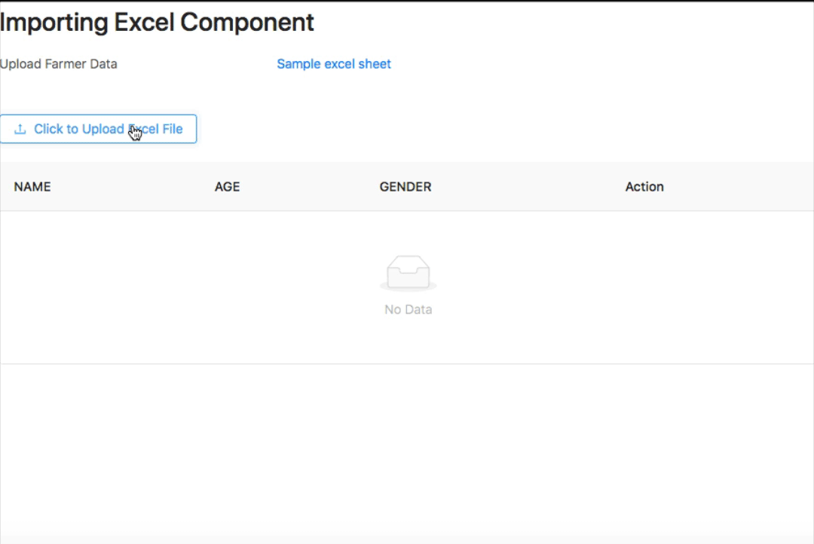

## An excel import app with React that allows for editing, deleting and adding rows to the imported data

To run: `npm run start`

To build: `npm run build`

Working sample on [Codesandbox](https://codesandbox.io/s/github/abiodunsulaiman694/excel-app/tree/master/)

[Article to explain the code on abiodun.dev](https://abiodun.dev/import-spreadsheets-or-excel-in-your-react-component/)
